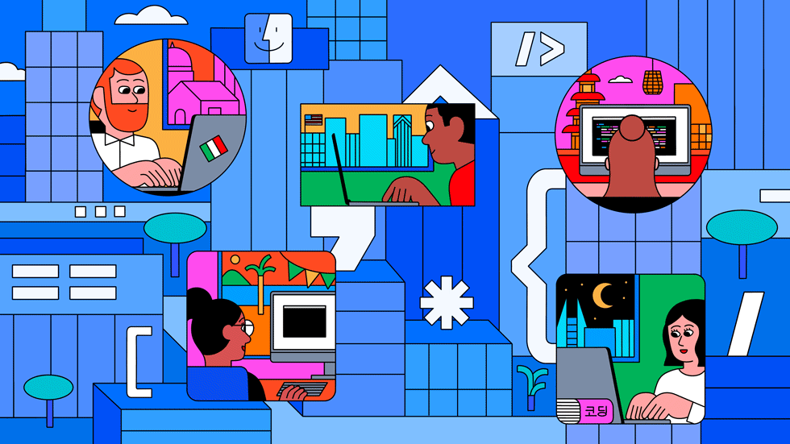

# ✌ Seja bem vindo(a) ao meu espaço. É um prazer te receber aqui!

- 🌐 Programadores cariocas: SENAC RJ + Prefeitura e [Resília Educação](https://www.resilia.com.br/)
- 🌱 Estudante de HTML E CSS, todos temos um começo!
- 💻 Futuro Full-Stack

  &nbsp;
  &nbsp;

---

  

